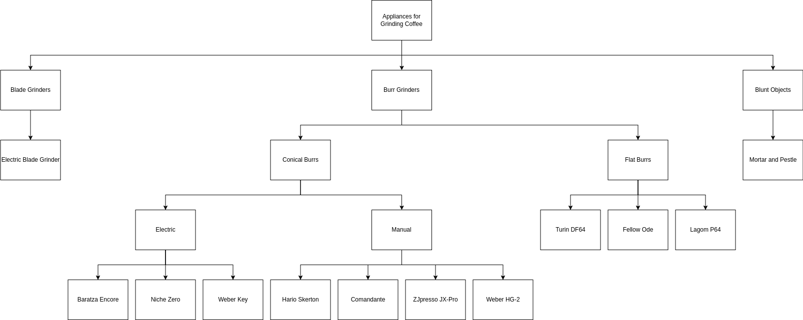

# Tree Diagrams

These very useful diagram types are why drawpyo was written initially! The TreeDiagram module allows the easy creation of heirarchical directed trees, managing the tree parent and children relationships, then providing a convenient auto layout function.

## Create a Tree

The two main objects to work with in drawpyo's trees are TreeDiagrams and NodeObjects. To start, create a TreeDiagram:

```python
import drawpyo.diagram_types import TreeDiagram

tree = TreeDiagram(
    file_path = 'path/to/tree',
    file_name = 'Tree Name.drawio',
)
```

There are a number of configuration parameters available to fine tune the layout of the TreeDiagram. They can be passed in during initialization or later.

| Parameter     | Effect                                                                      | Default      |
| ------------- | --------------------------------------------------------------------------- | ------------ |
| direction     | direction that the tree grows from the root ('up', 'down', 'left', 'right') | 'down'       |
| link_style    | Connection style of the edges ('orthogonal', 'straight', 'curved')          | 'orthogonal' |
| level_spacing | Spacing in pixels between levels                                            | 60           |
| item_spacing  | Spacing in pixels between groups within a level                             | 15           |
| padding       | Spacing in pixels between objects within a group                            | 10           |

## Add Nodes

The custom object type that defines the nodes on the tree are called NodeObjects. Create some NodeObjects:

```python
from drawpyo.diagram_types import NodeObject

# Top object
grinders = NodeObject(tree=tree, value="Appliances for Grinding Coffee", base_style="rounded rectangle")

# Main categories
blade_grinders = NodeObject(tree=tree, value="Blade Grinders", tree_parent=grinders)
burr_grinders = NodeObject(tree=tree, value="Burr Grinders", tree_parent=grinders)
blunt_objects = NodeObject(tree=tree, value="Blunt Objects", tree_parent=grinders)
```

Note that the base_style was manually declared for the first object. But NodeObjects will default to "rounded rectangle" so it's not necessary for every one. Any NodeObject can be a tree parent, so you can keep adding objects down the tree:

```python
# Other
elec_blade = NodeObject(tree=tree, value="Electric Blade Grinder", tree_parent=blade_grinders)
mnp = NodeObject(tree=tree, value="Mortar and Pestle", tree_parent=blunt_objects)

# Conical Burrs
conical = NodeObject(tree=tree, value="Conical Burrs", tree_parent=burr_grinders)
elec_conical = NodeObject(tree=tree, value="Electric", tree_parent=conical)
manual_conical = NodeObject(tree=tree, value="Manual", tree_parent=conical)
```

> **Important Note:** TreeDiagrams do not currently support NodeObjects with multiple tree parents! It may not ever as this seriously complicates the auto layout process. However, you can add links between any two objects in the tree and render them in the diagram. They just may look ugly until you manually rearrange the diagram.

Finally, before writing the diagram you'll want to run the magic penultimate step: auto layout.

```python
tree.auto_layout()
tree.write()
```

With some more additions, the resulting diagram renders as:


